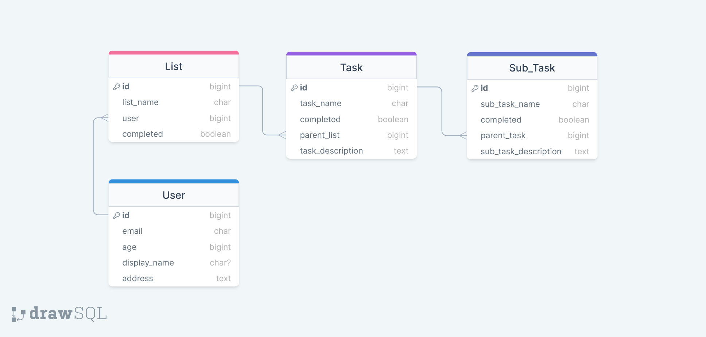

# User Authentication

In this assignment you will create a user and add user permissions to an already existing API.

## Assignment

Create an App_User for your To-Do-List API and create the endpoints to fulfill the follwoing requirements:

- `POST /api/users/signup/` status 201 success | 400 bad-request

> Receives all arguments in the `request.body` needed to successfully create a new user. Remember Email must be a unique identifier
> Responds with a newly generated user Auth Token

- `POST /api/users/login/` status 200 success | 404 none-exist | 400 bad-request

> Receives all credentials needed to `authenticate` a user
> Returns an already existing/newly created Auth Token

- `POST /api/users/logout/` status 204 success | 401 unauthorized

> Deletes a users authentication Token and returns an empty response

- `PUT /api/users/` status 200 success | 401 unauthorized | 400 bad-request

> Updates user age display_name and address if included in the requests body
> ONLY updates password if the `new_password` and `old_password` are included in the request and the `old_password` and current email authenticates to the current existing user.

### Lists

- `GET /api/lists/<int:id>/`  status 200 success | 404 none-exit

> Returns a specific List with all of it's tasks listed under it

- `PUT /api/lists/<int:id>/` status 204 success | 404 none-exist | 400 bad-req

> Updates a list name

- `DELETE /api/lists/<int:id>/` status 204 success | 404 none-exist

> Deletes a list and all of its task and subtasks

- `GET /api/lists/` status 200 success

> Returns all existing lists

- `POST /api/lists/` status 201 success | 400 bad-req

> Creates a new list and returns the newly created list in the response

### Tasks

- `GET /api/lists/<int:id>/tasks/<int:task_id>/`  status 200 success | 404 none-exit

> Returns a specific task with all of it's sub-tasks listed under it

- `DELETE /api/lists/<int:id>/tasks/<int:task_id>/` status 204 success | 404 none-exist | 400 bad-req

> Updates a task name and a tasks completed status

- `DELETE /api/lists/<int:id>/tasks/<int:task_id>/` status 204 success | 404 none-exist

> Deletes task and all of its subtasks

- `GET /api/lists/<int:id>/tasks/` status 200 success

> Returns all existing tasks corresponding to this list

- `POST /api/lists/<int:id/tasks/` status 201 success | 400 bad-req

> Creates a new task corresponding to this list and returns the newly created task in the response

### Sub-Tasks

- `GET /api/lists/<int:id>/tasks/<int:task_id>/subtasks/<int:subtask_id>/`  status 200 success | 404 none-exit

> Returns a specific sub-task

- `DELETE /api/lists/<int:id>/tasks/<int:task_id>/subtasks/<int:subtask_id>/` status 204 success | 404 none-exist | 400 bad-req

> Updates a sub-task name and a sub-tasks completed status

- `DELETE /api/lists/<int:id>/tasks/<int:task_id>/subtasks/<int:subtask_id>/` status 204 success | 404 none-exist

> Deletes a sub-task

- `GET /api/lists/<int:id>/tasks/<int:task_id>/subtasks/` status 200 success

> Returns all existing sub-tasks corresponding to this list

- `POST /api/lists/<int:id/tasks/<int:task_id>/subtasks/` status 201 success | 400 bad-req

> Creates a new sub-task corresponding to this task and returns the newly created sub-task in the response

### Behavior

- List deleted

> if a list is deleted all of its tasks and subtasks will be deleted as well

- Task deleted

> if a task is deleted all of its subtasks will be deleted

- Task marked completed

> if a task is marked as completed all of it's subtask should be updated to completed as well

- Sub Task maked completed

> if all sub-tasks of a task are marked as completed the parent task itself should be marked as completed

- Creating Subtask

- if a task is marked as completed but the user creates a subtask for said task the tasks completed value should be updated to incomplete

**`MAKE SURE YOU ARE WRITING TEST AND VALIDATORS FOR YOUR PROGRAM`**

## Adding Permissions

The following API endpoints should only be accessible to requests that provide a valid Authentication Token under the Authorization Header and should only respond with Lists/Tasks/SubTasks that belong to this user. If the Token is not valid or included in the request, we should recieve an 401 HTTP response.

- `/api/lists/`
- `/api/lists/<int:id>/`
- `/api/lists/<int:id>/tasks/`
- `/api/lists/<int:id>/tasks/<int:task_id>/`
- `/api/lists/<int:id>/tasks/<int:task_id>/subtasks/`
- `/api/lists/<int:id>/tasks/<int:task_id>/subtasks/<int:subtask_id>/`  
